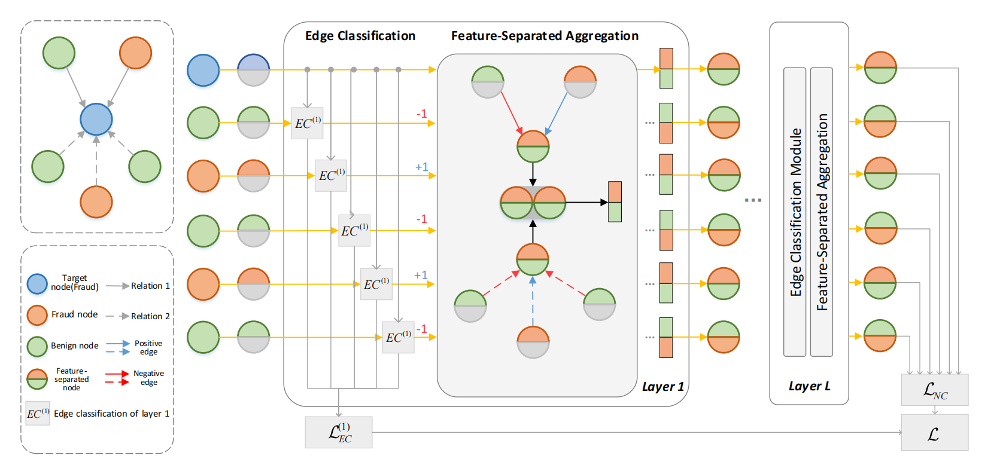

# FEAST-GNN

This is the PyTorch implementation of the FEAST-GNN: Feature-Separated Graph Neural Network for Fraud Detection with Heterophily.



# Dependencies

- Python >= 3.8
- numpy >= 1.22.4
- scipy >= 1.4.1
- scikit-learn >= 1.1.2
- [PyTorch](https://pytorch.org/) >= 1.11.0
- [DGL](https://www.dgl.ai/) >= 0.9.1

# Usage

- ```src/```: includes all code scripts.
- ```data/```: includes original datasets:
  - ```YelpChi.zip```: The original dataset of YelpChi, which contains hotel and restaurant reviews filtered (spam) and recommended (legitimate) by Yelp.
  - ```Amazon.zip```: The original dataset of Amazon, which contains product reviews under the Musical Instruments category.
  - ```FDCompCN.zip```: The processed dataset of FDCompCN, which contains financial statement fraud of companies in China from CSMAR database.
- ```config/```: includes the setting of parameters for two datasets.
  - ```yelp.yaml```: The general parameters of YelpChi.
  - ```amazon.yaml```: The general parameters of Amazon.
  - ```comp.yaml```: The general parameters of FDCompCN.
- ```result/```: includes the trained models.
  - ```yelp.pt```: The trained model for YelpChi.
  - ```amazon.pt```: The trained model for Amazon.
  - ```comp.pt```: The trained model for FDCompCN.
  - ```yelp_0.05.pt```: The trained model for YelpChi of 5% training ratio.

# Datasets

Statistical information of Yelp, Amazon and FDCompCN datasets.

| dataset | #Nodes(Fraud%)  | \#Features | Relation                                 | \#Edges                                                | H_node                                     | H_edge                                       |
| ------- | --------------- | ---------- | ---------------------------------------- | ------------------------------------------------------ | ------------------------------------------ | -------------------------------------------- |
| Yelp    | 45,954 (14.54%) | 32         | R-U-R <br/>R-T-R <br/>R-S-R <br/>Homo | 98,630 <br/>1,147,232 <br/>6,805,486 <br/>7,693,958  | 0.925 <br/>0.180 <br/>0.205 <br/>0.195  | 0.909 <br/>0.176 <br/>0.186 <br/>0.184    |
| Amazon  | 11,944 (6.87%)  | 24         | U-P-U <br/>U-S-U <br/>U-V-U <br/>Homo | 351,216<br/>7,132,958 <br/>2,073,474 <br/>8,796,784 | 0.100 <br/>0.103 <br/>0.183 <br/>0.103} | 0.167 <br/>0.056 <br/>0.053	<br/>0.072 |
| FDCompCN | 5,317 (10.5%) |  57 |  C-I-C <br/>C-P-C <br/>C-S-C <br/>Homo |  5,548 <br/>760 <br/>1,042 <br/>7,268 | 0.1528 <br/>0.0897<br/>0.1016<br/>0.1383 |  0.1367 <br/>0.0870 <br/>0.0833<br/>0.1231|

# Model Training

We take Yelp as an example to illustrate the usage of repository.

```python
# Unzip the dataset
unzip ./data/YelpChi.zip ./data/

# Move to src/
cd src/

# Convert the original dataset to dgl graph
# The generated dgl graph contains the features, graph structure and edge labels.
python data_preprocess.py --dataset yelp

# Train and test the dataset
# If you want to change the parameters in training process, you can modify the corresponding yaml file in config.
python train.py --dataset yelp 
```

# Expreimental Results

Experimental results (Mean ± Std.) of methods on datasets. 

| Dataset       | Yelp              |                   |                   |                   | Amazon            |                   |                   |                   | FDCompCN            |                   |                   |                   |
| ------------- | ----------------- | ----------------- | ----------------- | ----------------- | ----------------- | ----------------- | ----------------- | ----------------- |  ----------------- | ----------------- | ----------------- | ----------------- |
| Metrics       | AUC               | GMean             | F1-macro          | Recall            | AUC               | GMean             | F1-macro          | Recall            | AUC               | GMean             | F1-macro          | Recall            |
| XGBoost                       | 0.7081±0.0097          | 0.7029±0.01101         | 0.6451±0.0114          | 0.6261±0.0298          | 0.8222±0.0039          | 0.8203±0.0043          | 0.7230±0.0026          | 0.7667±0.0095          | 0.5906±0.0166          | 0.5895±0.0168          | 0.4793±0.0218          | 0.5830±0.0337          |
| MLP                           | 0.7741±0.0001          | 0.7053±0.0010          | 0.6015±0.0060          | 0.7189±0.0123          | 0.8706±0.0126          | 0.8081±0.0638          | 0.7035±0.0941          | 0.7864±0.0290          | 0.5924±0.0058          | 0.4957±0.0041          | 0.5035±0.0060          | 0.3290±0.0077          |
| GCN                           | 0.6003±0.0021          | 0.5632±0.0022          | 0.4758±0.0090          | 0.5784±0.0310          | 0.8065±0.0500          | 0.7069±0.0447          | 0.5693±0.0463          | 0.7218±0.1275          | 0.5724±0.0091          | 0.5361±0.0217          | 0.4725±0.0252          | 0.4643±0.0773          |
| GAT                           | 0.6591±0.0707          | 0.6261±0.0842          | 0.5246±0.0848          | 0.6770±0.0734          | 0.8803±0.0293          | 0.8136±0.0268          | 0.7186±0.0454          | 0.7600±0.0255          | 0.6041±0.0022          | 0.5483±0.0265          | 0.5004±0.0142          | 0.4433±0.0796          |
| GPRGNN                        | 0.7633±0.0044          | 0.6928±0.0023          | 0.5682±0.0037          | 0.7469±0.0118          | 0.8692±0.0182          | 0.7929±0.0179          | 0.6393±0.0219          | 0.7353±0.0452          | 0.6411±0.0204          | 0.4674±0.0992          | 0.4385±0.1457          | 0.5325±0.2990          |
| FAGCN                         | 0.7544±0.0090          | 0.6747±0.0157          | 0.5483±0.0344          | 0.7784±0.0584          | 0.9055±0.0051          | 0.8331±0.0106          | 0.7402±0.0069          | 0.7814±0.0293          | 0.6213±0.0083          | 0.5241±0.0431          | 0.4469±0.0809          | 0.5799±0.2404          |
| H2GCN                         | 0.8424±0.0030          | 0.7645±0.0032          | 0.6615±0.0070          | 0.7755±0.0200          | 0.9060±0.0013          | 0.8442±0.0029          | 0.7302±0.0019          | 0.8173±0.0061          | 0.5451±0.0344          | 0.4590±0.0127          | 0.5077±0.0177          | 0.2679±0.0108          |
| BWGNN | 0.9037±0.0066 | 0.8229±0.0078 | 0.7249±0.0110 |  0.8354±0.0303 | 0.9167±0.0056 | 0.8416±0.0092 | 0.7282±0.0101 | 0.8136±0.0226 | 0.5936±0.0172 | 0.4923±0.0435 | 0.4546±0.0808 | 0.4902±0.2473 |
| CARE-GNN                      | 0.7873±0.0047          | 0.7094±0.0062          | 0.6258±0.0214          | 0.6839±0.0584          | 0.8610±0.0009          | 0.8153±0.0030          | 0.7240±0.0024          | 0.7539±0.0052          | 0.6639±0.0108          | 0.5894±0.0144          | 0.5072±0.0395          | 0.5357±0.0898          |
| RioGNN                        | 0.8150±0.0124          | 0.7382±0.0151          | 0.6328±0.0273          | 0.7574±0.0295          | 0.8843±0.0067          | 0.8215±0.0068          | 0.7310±0.0087          | 0.7642±0.0218          | 0.6233±0.0167          | 0.5365±0.0308          | 0.4850±0.0649          | 0.4876±0.1780          |
| H2-FDetector         | 0.8841±0.0166          | 0.8028±0.0154          | 0.7067±0.0214          | 0.8104±0.0569          | 0.8997±0.0085          | 0.8253±0.0330          | 0.7232±0.0151          | 0.7842±0.0803          | 0.5823±0.0515          | 0.5093±0.0491          | 0.4351±0.1008          | 0.5474±0.1947          |
| FEAST\FS | 0.7780±0.0399          | 0.7120±0.0349          | 0.5779±0.0501          | 0.8278±0.0235          | 0.9041±0.0041          | 0.8238±0.0090          | 0.7147±0.0204          | 0.7867±0.0433          | 0.6157±0.0569          | 0.5636±0.0638          | 0.4932±0.0290          | 0.5004±0.1261          |
| **FEAST-GNN**            | **0.9201±0.0029** | **0.8418±0.0033** | **0.7489±0.0056** | **0.8504±0.0158** | **0.9221±0.0025** | **0.8571±0.0036** |**0.7430±0.0090** | **0.8364±0.0112** | **0.6976±0.0212** | **0.6481±0.0247** | **0.5390±0.0256** | **0.6161±0.0505** |

Experimental results (Mean ± Std.) and training time (seconds/epoch) of methods on dataset. 

| Dataset       | Yelp ( 5% )       |                   |                   |                   |       |
| ------------- | ----------------- | ----------------- | ----------------- | ----------------- | ----- |
| Metric        | AUC               | GMean             | F1-macro          | Recall            | Time  |
| XGBoost       | 0.6766±0.0115     | 0.6661±0.0190     | 0.6227±0.0113     | 0.5684±0.0571     | -     |
| MLP           | 0.7643±0.0003     | 0.7010±0.0016     | 0.6011±0.0049     | 0.7056±0.0168     | 0.003 |
| GCN           | 0.5963±0.0021     | 0.5587±0.0076     | 0.4685±0.0300     | 0.5958±0.0695     | 0.007 |
| GAT           | 0.6300±0.0300     | 0.6048±0.0298     | 0.5151±0.0358     | 0.6116±0.0376     | 0.014 |
| GPRGNN        | 0.7468±0.0039     | 0.6836±0.0037     | 0.5616±0.0106     | 0.7348±0.0354     | 0.018 |
| FAGCN         | 0.7439±0.0059     | 0.6525±0.0322     | 0.5568±0.0655     | 0.7057±0.1379     | 0.062 |
| H2GCN         | 0.8301±0.0006     | 0.7512±0.0020     | 0.6477±0.0100     | 0.7631±0.0267     | 0.397 |
|   BWGNN | 0.8419±0.0041 | 0.7656±0.0060 |0.6599±0.0183 | 0.7850±0.0365 |  0.238 |
| CARE-GNN      | 0.7588±0.0011     | 0.6966±0.0020     | 0.5971±0.0078     | 0.7012±0.0222     | 0.415 |
| RioGNN        | 0.7862±0.0073     | 0.7192±0.0056     | 0.6204±0.0134     | 0.7219±0.0365     | 0.512 |
| H2-FDetector  | 0.7759±0.0498     | 0.7387±0.0514     | 0.6228±0.0676     | 0.7839±0.0432     | 1.389 |
| **FEAST-GNN** | **0.8673±0.0026** | **0.7890±0.0056** | **0.6942±0.0127** | **0.7885±0.0326** | 2.857 |

# Reproduce Results

The hyperparameter of FEAST-GNN to reproduce the results.

| Paramater   | Yelp    | Amazon  | FDCompCN |
|---------------|---------|---------|----------|
| learning rate | 0.02    | 0.01    | 0.001    |
| weight decay  | 0.00005 | 0.00005 | 0.00005  |
| gamma      | 0.4     | 0.4     | 0.4      |
| n_hidden     | 8       | 8       | 8        |
| n_layers     | 2       | 2       | 2        |
| n_head       | 4       | 4       | 4        |
| dropout       | 0.1     | 0.1     | 0.1      |
| max epoch     | 1000    | 1000    | 1000     |
| early stop    | 100     | 50      | 100      |

We also provide trained models in ```result``` directory to reproduce the results.

```python
# Load the model to predict
model_path = '../result/yelp.pt'
model = torch.load(model_path)
```

# Run on your Datasets

To run FEAST-GNN on your datasets, you need to prepare the following data:

- A homogeneous or multi-relation graph
- Node labels
- Node features

Transform the data into DGL format using the code in data_preprocess.py as a reference.
